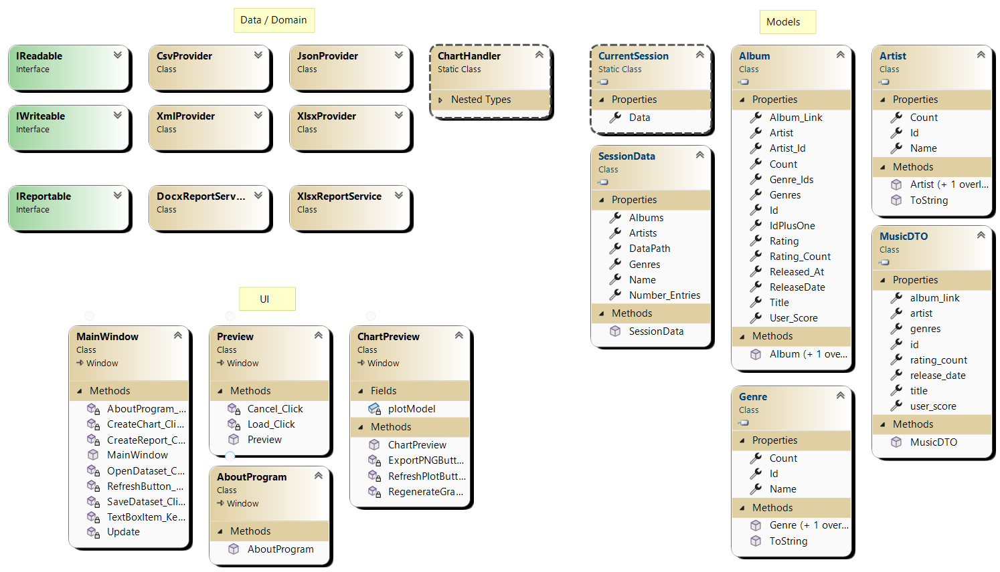

# Лабораторна робота №1  
**Тема:** Робота з файлами та даними у C# (CSV/JSON/XML/XLSX, звіти DOCX/XLSX, графіки)  
**Студент(ка):** Луцюк Богдан Олександрович КН-213  
**Варіант / набір даних:** 11 / https://www.kaggle.com/datasets/tabibyte/aoty-5000-highest-user-rated-albums  
**Дата:** 01.10.2025  
**Посилання на репозиторій/архів:** https://github.com/emissuu/UniTasks/tree/main/C%23/Lab1


## 1. Мета та завдання
**Мета:** Покращити навики написання коду та роботи зі сторонніми бібліотеками. Навчитись працювати з проєктами більшого масштабу.  
**Завдання:**  
- Імпорт даних із CSV/JSON/XML/XLSX.  
- Обробка/валідація/агрегація.  
- Експорт у всі формати (CSV/JSON/XML/XLSX).  
- Генерація звітів **XLSX** та **DOCX**.  
- Візуалізація (мінімум 2 графіки) зі стороннім компонентом.  
- Архітектура у 3 збірках (Domain/Data/UI), діаграма класів.


## 2. Опис датасету
**Походження/джерело:** https://www.kaggle.com/datasets/tabibyte/aoty-5000-highest-user-rated-albums  
**Структура полів (приклад таблиці):**

| Поле  | Тип | Приклад значення | Опис/правила |
|-------|-----|-----------------:|--------------|
| Id    | int | 1 | Унікальний ідентифікатор |
| Title | string | To Pimp a Butterfly | Назва альбому |
| Artist| string | Kendrick Lamar | Ім'я автора альбому |
| Release_Date | string | March 15, 2015 | Дата релізу альбому |
| Genres | string | Conscious Hip Hop, Jazz Rap, West Coast Hip Hop | Жанри пісень альбому |
| User_Score | int | 95 | Середній рейтинг альбому |
| Rating_Count | string | 28,594 ratings | Кількість оцінок альбому |
| Album_Link | string | https://www.albumoftheyear.org/album/29250-kendrick-lamar-to-pimp-a-butterfly.php | Посилання на альбом | 

**Обсяг:** рядків: 5000, стовпців: 8  
**Проблеми якості:** Неправильний формат деяких дат, коми в числах, присутність тексту в числових полях  


## 3. Модель предметної області
**Виділені сутності:** Albums, Artists, Genres 
**Зв’язки:** 1 до багатьох, багато до багатьох  
**Діаграма класів (UML):**   
Зв'язки були вибрані шляхом логічного аналізу кожного з об'єктів. Тому один автор може мати багато альбомів, а різні жанри можуть входити до одного чи до багатьох альбомів. 


## 4. Архітектура застосунку
**Збірки/шари:**  
- **Domain (Core/Model):** ChartHandling, Interfaces, Providers, Reports  
- **Data (Infrastructure):** Entities, Validation  
- **UI (Presentation):** Windows, Resources.  

**Дерево рішень (спрощено):**
```
/DataProcessing
  /Data
    /ChartHandling/*.cs
    /Interfaces/{IReadable, IWriteable, IReportable}.cs
    /Providers/{JSON, XML, XLSX, CSV}.cs
    /Reports/{DOCX, XLSX}.cs
  /Models
    /Entities/*.cs
    /Validation/*.cs
  /UI
    /Windows/*.{xaml, xaml.cs}
  /Resources/MusicStoreIcon.png
```
**Залежності/NuGet:** CsvHelper, System.Text.Json, System.Xml.Serialization, EPPlus, OpenXML, OxyPlot.


## 5. Імпорт та чистка даних
**Підтримувані формати імпорту:** CSV, JSON, XML, XLSX.  
**Перетворення та валідація:**  
- При неправильному форматі дати, вона обробляється додатково. Якщо дату не вийшло перетворити, вона замінюється на 01-01-1970  
- Якщо число містить коми, вони відповідно обробляються до правильного числового формату. 
- При наявності пробілів зайвих ком, вони відчищуються від даних.  


## 6. Операції над даними
**Фільтрація/пошук/сортування:** Інтерфейс прорграми дозволяє фільтрувати дані за текстом чи числовими значеннями деяких рядків.Також дозволяє сортування за будь яким рядком.  
**Групування та агрегування:** Програма рахує унікальні об'єкти в датасеті. До них відносяться альбоми, автори і жанри.  
**Редагування:** Також програма дозволяє редагування датасету.  


## 7. Експорт даних
**Підтримувані формати експорту:** CSV, JSON, XML, XLSX.    
**Перевірка якості експорту:** Програма правильно експортує дані, що пізніше дозволяє успішно завантажити дані в програму. При виникненні будь-яких проблем під час експорту повідомляє користувача про це.


## 8. Звіти
### DOCX-звіт    
Автоматично згенерований звіт містить основні дані про датасет, його розмір, кількість деяких унікальних об'єктів. Також має 3 графіки, що ще краще описують датасет для користувача.  


## 9. Візуалізація
**Компонент:** OxyPlot   
Було написано 4 методи для побудування чотирьох унікальних графіків, що відображають різні аспекти датасету.


## 10. Інтерфейс користувача
**Екрани/форми:** MainWindow, Preview, ChartPreview, AboutProgram   

**Повідомлення про помилки/винятки:**  


## 11. Контрольні питання (для самоперевірки)
1. Чому обрана саме така модель сутностей і зв’язків? 
Така модель зв'язків найкраще описує датасет та дозволяє ефективно з ним працювати.  
2. Де реалізовані валідація й агрегування?  
Вони реалізовані з partial класах. Тому його інтеграція в іншій папці майже не відчувається.  
3. Як реалізовано імпорт кожного формату?  
Імпорт кожного формату відбувається за допомогою особливостей наслідування, що дозволяє легко обирати відповідний клас для кожного з них.  
4. Як обробляються типові помилки I/O?  
За допомогою класичного набору catch-ів, що відловлюють всі специфічні помилки і повідомляють про них користувачеві.  
5. Як формується кожен звіт і як оновлюється при фільтрах?  
Кожен звіт показує величину імпортованого датасету і динамічно використовує послуги класу ChartHandler, тому графіки в звіті завжди актуальні при кожній генерації.  


## 12. Використання AI
- Які інструменти AI застосовано: ChatGPT, Gemini.  
- Для чого саме: Для порад в написанні коду і в поясненні деяких бібліотек. Ближче до захисту ШІ був застосований для підказок і наведення на правильні рішення, задля уникнення ступорів.   
- **Підтвердження:** Я розумію всі застосовані концепти написаного коду і головні ідеї, за якими він був написаний. Готовий захищати код на захисті.


## 13. Висновки
Під час виконання цієї лабораторної роботи я засвоїв багато навиків і здобув досвід в написанні програм. Також навчився працювати з даними на C# застосовуючи WPF для побудування інтерфейсів. Однозначно покращив свою стресостійкість і продуктивність. 