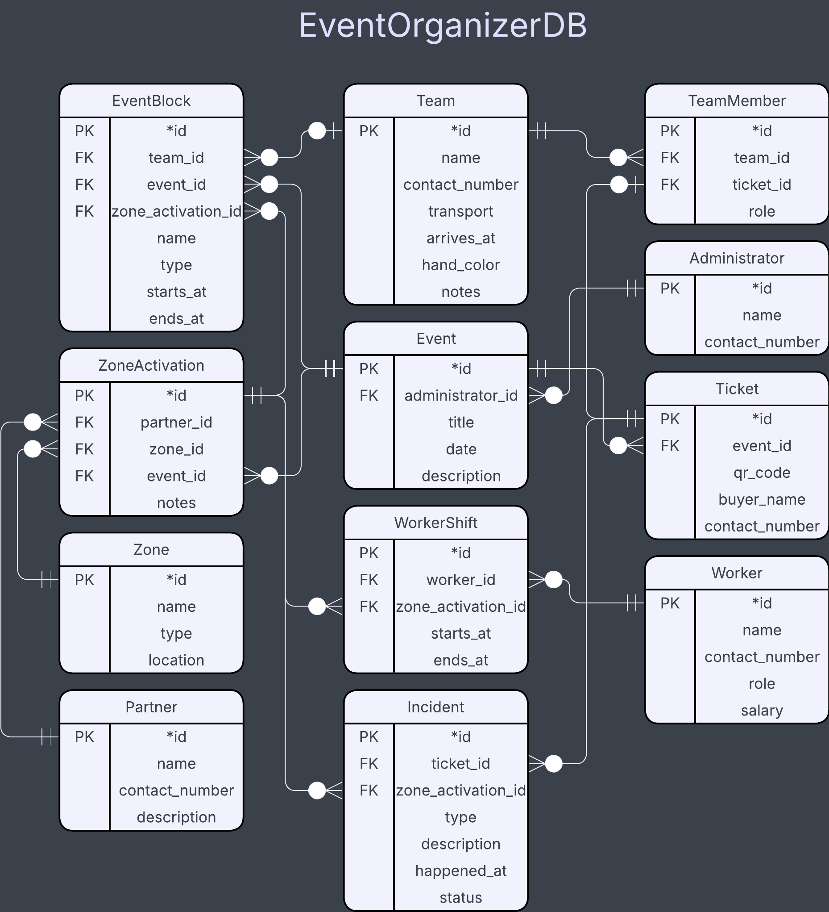
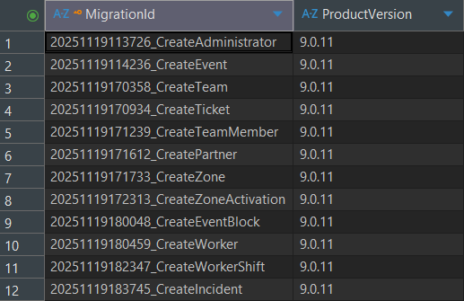
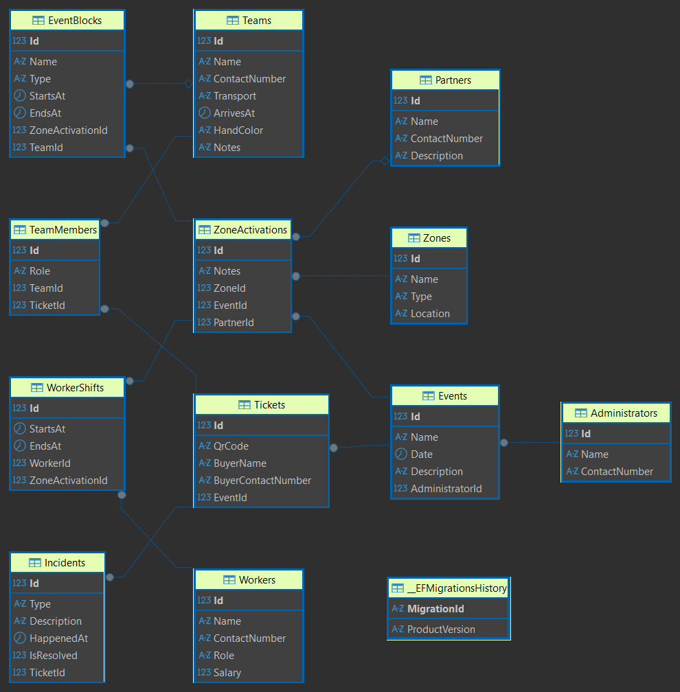

# Лабораторна робота №2  
**Тема:** Моделювання предметної області та створення реляційної бази даних у C# за допомогою EF Core (Code First)  
**Студент:** Луцюк Богдан Олександрович КН-213  
**Варіант:** 32 - Координатор подій, що організовує фестивалі  
**Дата:** 14.11.2025  
**Посилання на репозиторій:** https://github.com/emissuu/UniTasks/tree/main/C%23/Lab2

<!-- The dialog: https://kleban.notion.site/2-2a6c0ae924ac8074b50aced556a4c72f?p=2a6c0ae924ac8157ab24c1cc5d9226d1&pm=s -->

## 2. Мета роботи 
**Навчитися:**
- аналізувати предметну область і будувати концептуальну модель;
- створювати об’єктно-реляційну модель за допомогою **Entity Framework Core (Code First)**;
- поетапно розвивати структуру бази даних через **окремі міграції для кожної сутності**;
- ініціалізувати дані та виконувати базові запити LINQ.

## 3. Хід виконання
### 3.1. Аналіз предметної області (опис, таблиці, діаграма).
Після аналізу діалогу студента з замовником було винесено 12 сутностей:  
- Event: *id, administrator_id, title, date, description.
- EventBlock: *id, team_id, zone_activation_id, name, type, starts_at, ends_at.
- Team: *id, name, contact_number, transport, arrives_at, hand_color, notes.
- TeamMember: *id, team_id, ticket_id, role.  
- Ticket: *id, event_id, qr_code, buyer_name, buyer_contact_number.  
- Administrator: *id, name, contact_number.  
- Partner: *id, name, contact_number, description.
- Zone: *id, name, type, location.
- ZoneActivation: *id, partner_id, zone_id, event_id, notes.
- Worker: *id, name, contact_number, role, salary.
- WorkerShift: *id, worker_id, zone_activation_id, starts_at, ends_at.
- Incident: *id, ticket_id, type, description, happened_at, is_resolved.  

З цих сутностей було побудовано схему:  

  

### 3.2. Створення класів сутностей та контексту бази даних.
Було створено клас C# для кожної сутності бази даних. Ось зразок одного з таких класів:

```cs
public class Event
{
    [Key]
    [DatabaseGenerated(DatabaseGeneratedOption.Identity)]
    public int Id { get; set; }
    [Required]
    public string Name { get; set; }
    public DateTime? Date { get; set; }
    public string? Description { get; set; }

    [Required]
    public int AdministratorId { get; set; }
    [ForeignKey(nameof(AdministratorId))]
    public Administrator Administrator { get; set; }

    public virtual ICollection<Ticket> Tickets { get; set; } = new List<Ticket>();
    public virtual ICollection<ZoneActivation> ZoneActivations { get; set; } = new List<ZoneActivation>();
}
```

Фінальний код AppDbContext:

```cs
public class AppDbContext : DbContext
{
    public DbSet<Administrator> Administrators => Set<Administrator>();
    public DbSet<Event> Events => Set<Event>();
    public DbSet<Team> Teams => Set<Team>();
    public DbSet<Ticket> Tickets => Set<Ticket>();
    public DbSet<TeamMember> TeamMembers => Set<TeamMember>();
    public DbSet<Partner> Partners => Set<Partner>();
    public DbSet<Zone> Zones => Set<Zone>();
    public DbSet<ZoneActivation> ZoneActivations => Set<ZoneActivation>();
    public DbSet<EventBlock> EventBlocks => Set<EventBlock>();
    public DbSet<Worker> Workers => Set<Worker>();
    public DbSet<WorkerShift> WorkerShifts => Set<WorkerShift>();
    public DbSet<Incident> Incidents => Set<Incident>();
    protected override void OnConfiguring(DbContextOptionsBuilder optionsBuilder)
    {
        optionsBuilder.UseSqlServer("Data Source=localhost\\SQLEXPRESS;Initial Catalog=EventOrganizerDB;Integrated Security=True;Encrypt=True;TrustServerCertificate=True;Command Timeout=0");
        base.OnConfiguring(optionsBuilder);
    }
    protected override void OnModelCreating(ModelBuilder modelBuilder)
    {
        DbInitializer.SeedTHEData(modelBuilder);
        base.OnModelCreating(modelBuilder);
    }
}
```

### 3.3. Послідовність створених міграцій (із коротким описом змін).
Я створював міграції відразу після написання сутностей і налаштування зв'язків між ними. Перші міграції також включали в себе виправлення помилок в минулих сутностях. Ось фінальна таблиця всіх міграцій зображена в DBeaver.  


### 3.4. Ініціалізація даних та приклади запитів LINQ.
Частина коду ініціалізації даних:
```cs
public static class DbInitializer
{
    public static void SeedTHEData(this ModelBuilder modelBuilder)
    {
        // ===== Participants =====
        modelBuilder.Entity<Participant>().HasData(
            new Participant { Id = 1, Name = "SuperCoolBand", Arrives_At = new DateTime(2024, 7, 10, 14, 0, 0), Contact_Number = "555-1234", Hand_Color = "Red", Notes = "Requires soundcheck at 3 PM" },
            new Participant { Id = 2, Name = "JazzMasters", Arrives_At = new DateTime(2024, 7, 11, 10, 0, 0), Contact_Number = "555-5678", Hand_Color = "Blue", Notes = "Bringing their own equipment" }
            );

        // ===== TeamMembers =====
        modelBuilder.Entity<TeamMember>().HasData(
            new TeamMember { Id = 1, Name = "Alice", Role = "Vocalist", Participant_Id = 1, Contact_Number = "555-4128"},
            new TeamMember { Id = 2, Name = "Bob", Role = "Guitarist", Participant_Id = 1, Contact_Number = "555-4312" },
            new TeamMember { Id = 3, Name = "Charlie", Role = "Saxophonist", Participant_Id = 2, Contact_Number = "555-9412" },
            new TeamMember { Id = 4, Name = "Diana", Role = "Drummer", Participant_Id = 2, Contact_Number = "555-9481" },
            new TeamMember { Id = 5, Name = "Eve", Role = "Drummer", Participant_Id = 1, Contact_Number = "555-4144" }
            );
    }
}
```

Приклади запитів LINQ:
```cs
using (var context = new Main.Context.AppDbContext())
{
    // ===== Where =====
    Console.WriteLine("1. Where");
    List<Participant> participants = context.Participants
        .Where(a => a.Id == 1)
        .ToList();
    Console.WriteLine("Participants with Id = 1:");
    foreach (var participant in participants)
        Console.WriteLine($"Id {participant.Id}. Participant: {participant.Name}, Contact phone: {participant.Contact_Number}");

    // ===== FindOrDefault =====
    Console.WriteLine("\n2. FirstOrDefault");
    TeamMember teamMember = context.TeamMembers
        .FirstOrDefault(a => a.Id == 6);
    if (teamMember != null) Console.WriteLine($"Team Member with Id = 6: {teamMember.Name}");
    else Console.WriteLine("Team Member with Id = 6 not found.");

    // ===== Include =====
    Console.WriteLine("\n\n3. Include");
    List<TeamMember> teamMembers = context.TeamMembers
        .Include(a => a.Participant)
        .ToList();
    Console.WriteLine("Team Members with Participant included:");
    foreach (var member in teamMembers)
        Console.WriteLine($"Id {member.Id}. Team Member: {member.Name} is a member of {member.Participant.Name}");

    // ===== OrderBy =====
    Console.WriteLine("\n\n4. OrderBy");
    List<Accreditation> accreditations = context.Accreditations
        .OrderBy(a => a.Valid_To)
        .Include(a => a.Team_Member)
        .ToList();
    Console.WriteLine("Accreditations sorted by valid_to:");
    foreach (var accreditation in accreditations)
        Console.WriteLine($"Id {accreditation.Id}. Team Member: {accreditation.Team_Member.Name}, Valid To: {accreditation.Valid_To}");

    // ===== Average =====
    Console.WriteLine("\n\n5. Average");
    double? averagePerformances = context.Performances
        .Average(a => EF.Functions.DateDiffMinute(a.Starts_At, a.Ends_At));
    Console.WriteLine($"Average performance duration in minutes: {averagePerformances}");
}
```

Результати виконання LINQ запитів:  


LINQ запити є дуже потужним  та зручним інструментом для вибірки даних. Вони є невід'ємною частиною будь-якої програми, яка взаємодії з базами даних.

## 4. Результати роботи
Схема зв'язків зображена в DBeaver:  

 

## 5. Висновки 
Під час виконання цієї лабораторної роботи я покращив свої навики планування бази даних та її реалізації в коді C#. Вивичив особливості створення міграцій та заповнення бази даних за допомогою екстеншн методу. Попрактикував витягування даних з БД за допомогою класу LINQ. Також, покращив навики створення схеми бази даних і роботи з програмами LucidApp і DBeaver.