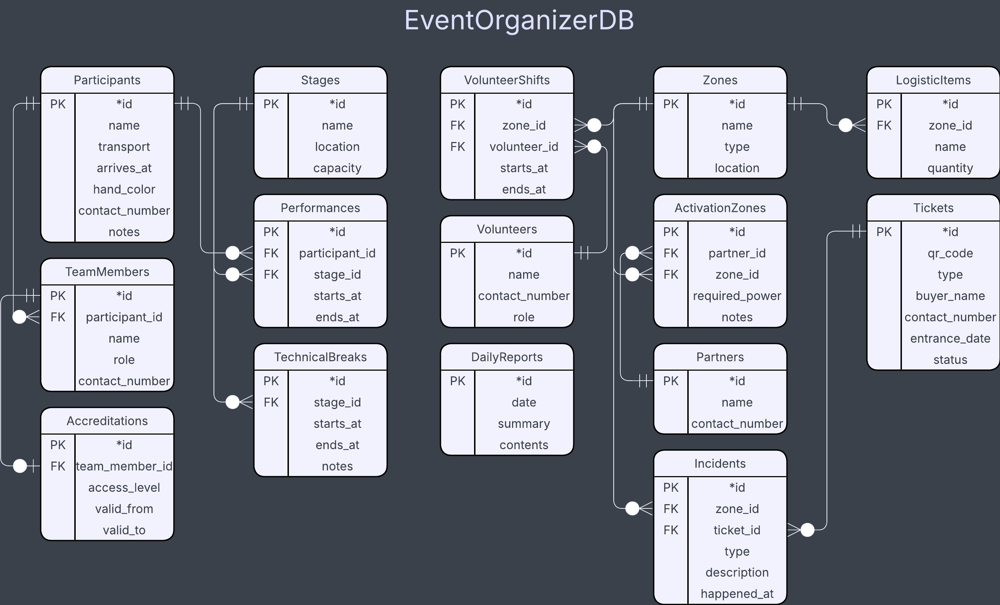

# Лабораторна робота №2  
**Тема:** Моделювання предметної області та створення реляційної бази даних у C# за допомогою EF Core (Code First)  
**Студент:** Луцюк Богдан Олександрович КН-213  
**Варіант:** 32 - Координатор подій, що організовує фестивалі  
**Дата:** 14.11.2025  
**Посилання на репозиторій:** https://github.com/emissuu/UniTasks/tree/main/C%23/Lab2

<!-- The dialog: https://kleban.notion.site/2-2a6c0ae924ac8074b50aced556a4c72f?p=2a6c0ae924ac8157ab24c1cc5d9226d1&pm=s -->

## 2. Мета роботи 
**Навчитися:**
- аналізувати предметну область і будувати концептуальну модель;
- створювати об’єктно-реляційну модель за допомогою **Entity Framework Core (Code First)**;
- поетапно розвивати структуру бази даних через **окремі міграції для кожної сутності**;
- ініціалізувати дані та виконувати базові запити LINQ.

## 3. Хід виконання
### 3.1. Аналіз предметної області (опис, таблиці, діаграма).
Після аналізу діалогу студента з закажчиком було винесено 15 сутностей:  
- Participants: *id, name, transport, arrives_at, hand_color, contact_number, notes.
- TeamMembers: *id, participant_id, name, role, contact_number.
- Accreditations: *id, team_member_id, valid_from, valid_to.

- Stages: *id, name, location, capacity.
- Performances: *id, participant_id, stage_id, starts_at, ends_at.
- TechnicalBreaks: *id, stage_id, starts_at, ends_at, notes.

- Volunteers: *id, name, contact_number, role.
- VolunteerShifts: *id, volunteer_id, zone_id, starts_at, ends_at.
  
- Partners: *id, name, contact_number.
- Zones: *id, name, type, location.
- ActivationZones: *id, partner_id, zone_id, required_power, notes.
- LogisticItems: *id, zone_id, name, quantity.

- Tickets: *id, qr_code, type, buyer_name, contact_number, entrance_date, status.
- Incidents: *id, zone_id, ticket_id, type, description, happened_at.
- DailyReports: *id, date, summary, contents.

З цих сутностей було побудовано схему:  


### 3.2. Створення класів сутностей та контексту бази даних.
Фінальний код AppDbContext:

```csharp
using Microsoft.EntityFrameworkCore;
using Main.Models;

namespace Main.Context
{
    public class AppDbContext : DbContext
    {
        public DbSet<Participant> Participants => Set<Participant>();
        public DbSet<TeamMember> TeamMembers => Set<TeamMember>();
        public DbSet<Accreditation> Accreditations => Set<Accreditation>();
        public DbSet<Stage> Stages => Set<Stage>();
        public DbSet<Performance> Performances => Set<Performance>();
        public DbSet<TechnicalBreak> TechnicalBreaks => Set<TechnicalBreak>();
        public DbSet<Volunteer> Volunteers => Set<Volunteer>();
        public DbSet<Zone> Zones => Set<Zone>();
        public DbSet<VolunteerShift> VolunteersShifts => Set<VolunteerShift>();
        public DbSet<Partner> Partners => Set<Partner>();
        public DbSet<ActivationZone> ActivationZones => Set<ActivationZone>();
        public DbSet<LogisticItem> LogisticItems => Set<LogisticItem>();
        public DbSet<Ticket> Tickets => Set<Ticket>();
        public DbSet<Incident> Incidents => Set<Incident>();
        public DbSet<DailyReport> DailyReports => Set<DailyReport>();
        protected override void OnConfiguring(DbContextOptionsBuilder optionsBuilder)
        {
            optionsBuilder.UseSqlServer("Data Source=localhost\\SQLEXPRESS;Initial Catalog=EventOrganizerDB;Integrated Security=True;Encrypt=True;TrustServerCertificate=True;Command Timeout=0");
            base.OnConfiguring(optionsBuilder);
        }
    }
}
```
Таблиця міграцій зображена в DBeaver.  


Схема зв'язків зображена в DBeaver


### 3.3. Послідовність створених міграцій (із коротким описом змін).
### 3.4. Ініціалізація даних та приклади запитів LINQ.

## 4. Результати роботи

## 5. Висновки 
