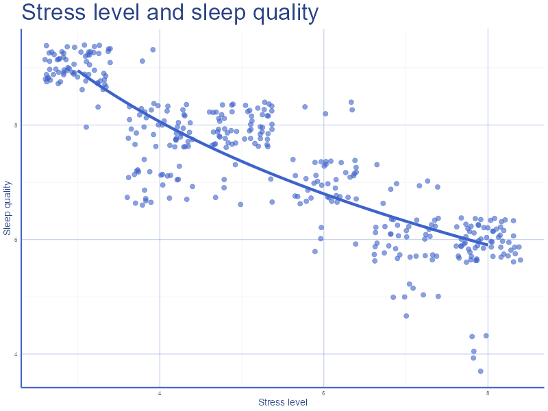
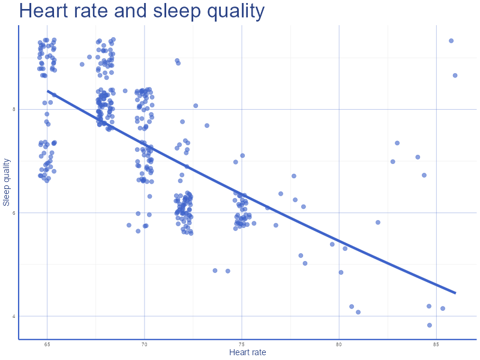
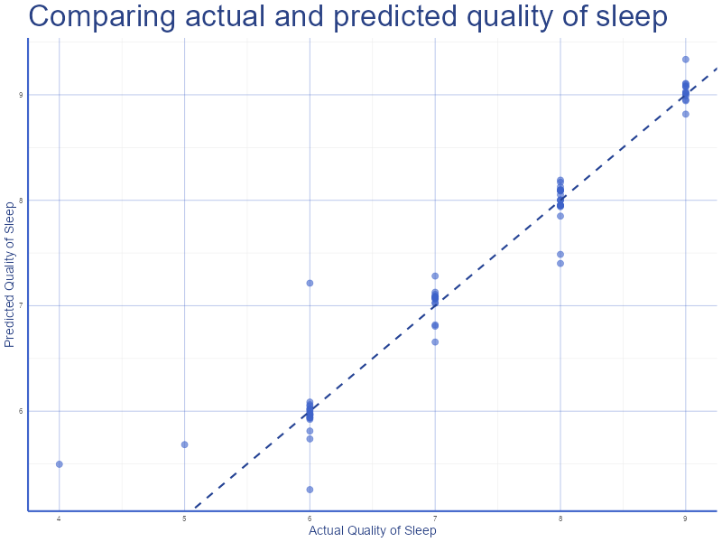

# Фінальний проєкт  
**Тема:** Аналіз та прогнозування якості сну  
**Студент:** Луцюк Богдан КН-2  
**Датасет:** [https://www.kaggle.com/...](https://www.kaggle.com/datasets/uom190346a/sleep-health-and-lifestyle-dataset)  
**Дата:** 24.11.2025  
**Репозиторій:** https://github.com/emissuu/UniTasks/tree/main/R/Final%20Project  

## 2. Опис проблеми та мети  
Головною метою цього дослідження є визначення основних факторів, що впливають на якість сну та сформувати рекомендації для його покращення.

## 3. Опис набору даних  
Набір даних був взятий з сайту [Kaggle](https://www.kaggle.com/datasets/uom190346a/sleep-health-and-lifestyle-dataset). Він має 13 стовпців і 374 записи. Назви, типи даних і приклади кожного з стовпців наведені нижче.
``` 
Rows: 374
Columns: 13
$ Person.ID               <int> 1, 2, 3, 4, 5, 6, 7, 8, 9, 10, 11, 12, 13, 14,…
$ Gender                  <chr> "Male", "Male", "Male", "Male", "Male", "Male"…
$ Age                     <int> 27, 28, 28, 28, 28, 28, 29, 29, 29, 29, 29, 29…
$ Occupation              <chr> "Software Engineer", "Doctor", "Doctor", "Sale…
$ Sleep.Duration          <dbl> 6.1, 6.2, 6.2, 5.9, 5.9, 5.9, 6.3, 7.8, 7.8, 7…
$ Quality.of.Sleep        <int> 6, 6, 6, 4, 4, 4, 6, 7, 7, 7, 6, 7, 6, 6, 6, 6…
$ Physical.Activity.Level <int> 42, 60, 60, 30, 30, 30, 40, 75, 75, 75, 30, 75…
$ Stress.Level            <int> 6, 8, 8, 8, 8, 8, 7, 6, 6, 6, 8, 6, 8, 8, 8, 8…
$ BMI.Category            <chr> "Overweight", "Normal", "Normal", "Obese", "Ob…
$ Blood.Pressure          <chr> "126/83", "125/80", "125/80", "140/90", "140/9…
$ Heart.Rate              <int> 77, 75, 75, 85, 85, 85, 82, 70, 70, 70, 70, 70…
$ Daily.Steps             <int> 4200, 10000, 10000, 3000, 3000, 3000, 3500, 80…
$ Sleep.Disorder          <chr> "None", "None", "None", "Sleep Apnea", "Sleep …
```
## 4. Описовий аналіз даних з візуалізацією (EDA)
### Матриця кореляцій


### Розподіл якості сну


### Вплив віку на якість сну


### Вплив довжини сну на якість сну


### Вплив рівню стресу на якість сну


### Вплив швидкості серцебиття на якість сну


### Вплив фізичної активності на якість сну


### Вплив професії на якість сну


## 5. Попередня підготовка даних
Так як мій датасет вже був чистим і не містив пропусків я всього лиш замінив деякі текстові колонки на фактори.
```r option_1=value
data_clean <- data |>
  mutate(
    Gender = factor(Gender),
    Occupation = factor(Occupation),
    BMI.Category = factor(BMI.Category),
    Sleep.Disorder = factor(Sleep.Disorder)
  )
glimpse(data_clean)
```

## 6. Формування тренувальної та тестової збірки
Дані було розділено на дві вибірки: тренувальну (80%) і тестову (20%)
```r option_1=value
set.seed(seed)
selected_vars <- data_clean |> select(where(is.numeric) | where(is.factor))

index <- createDataPartition(selected_vars$Quality.of.Sleep, p = 0.8, list = FALSE)
train_data <- selected_vars[index, ]
test_data <- selected_vars[-index, ]

cat("Sizes:\nTrain =", nrow(train_data), "\nTest =", nrow(test_data))
```
```
Sizes:
Train = 301 
Test = 73
```

## 7. Опис метрик якості моделі
Для оцінки моделі було використано такі метрики:
- RMSE (Коренева середньоквадратична помилка): вимірює середню помилку прогнозу у вихідних одиницях. Тобто, якщо RMSE = 0.3, то модель в середньому помиляється на 0.30 балів.
- R<sup>2</sup>: є стандартним значення для оцінки регресійних моделей. Показує частку дисперсії цільової змінної.

## 8. Побудова та оцінка моделі
Було побудовано лінійну модель.
```r
formula <- as.formula("Quality.of.Sleep ~ .")
model_lr <- lm(formula, data = train_data)
rmse <- sqrt(mean((test_data[["Quality.of.Sleep"]] - predictions)^2))
print(summary(model_lr))
cat("\n\nRSME =", rmse)
```
```
Call:
lm(formula = formula, data = train_data)

Residuals:
     Min       1Q   Median       3Q      Max 
-1.10452 -0.08406 -0.01773  0.05583  1.07248 

Coefficients:
                                 Estimate Std. Error t value Pr(>|t|)    
(Intercept)                     7.310e+00  8.182e-01   8.935  < 2e-16 ***
Person.ID                      -2.684e-03  1.273e-03  -2.109   0.0358 *  
Age                             8.829e-02  1.671e-02   5.285 2.54e-07 ***
Sleep.Duration                  2.569e-01  4.935e-02   5.205 3.78e-07 ***
Physical.Activity.Level        -8.676e-04  1.645e-03  -0.527   0.5984    
Stress.Level                   -3.273e-01  2.831e-02 -11.559  < 2e-16 ***
Heart.Rate                     -4.519e-02  1.041e-02  -4.342 1.99e-05 ***
Daily.Steps                     2.855e-05  1.979e-05   1.443   0.1502    
GenderMale                      5.471e-01  7.430e-02   7.364 2.04e-12 ***
OccupationDoctor               -6.393e-01  9.095e-02  -7.029 1.62e-11 ***
OccupationEngineer             -6.551e-01  8.623e-02  -7.597 4.68e-13 ***
OccupationLawyer               -4.771e-01  9.186e-02  -5.194 3.99e-07 ***
OccupationManager              -1.329e-01  2.359e-01  -0.563   0.5736    
OccupationNurse                -3.868e-01  8.341e-02  -4.637 5.45e-06 ***
OccupationSales Representative -1.986e+00  2.146e-01  -9.255  < 2e-16 ***
OccupationSalesperson          -8.472e-01  1.037e-01  -8.168 1.12e-14 ***
OccupationScientist            -7.898e-01  1.592e-01  -4.962 1.22e-06 ***
OccupationSoftware Engineer    -2.213e-01  1.492e-01  -1.483   0.1392    
OccupationTeacher              -5.542e-01  7.547e-02  -7.343 2.34e-12 ***
BMI.CategoryNormal Weight       1.479e-02  7.030e-02   0.210   0.8336    
BMI.CategoryObese               2.884e-01  1.930e-01   1.495   0.1361    
BMI.CategoryOverweight         -5.293e-01  7.605e-02  -6.960 2.46e-11 ***
Sleep.DisorderNone              2.307e-01  5.264e-02   4.383 1.66e-05 ***
Sleep.DisorderSleep Apnea       2.636e-01  6.217e-02   4.240 3.05e-05 ***
---
Signif. codes:  0 ‘***’ 0.001 ‘**’ 0.01 ‘*’ 0.05 ‘.’ 0.1 ‘ ’ 1

Residual standard error: 0.2144 on 277 degrees of freedom
Multiple R-squared:  0.9704,	Adjusted R-squared:  0.968 
F-statistic: 395.3 on 23 and 277 DF,  p-value: < 2.2e-16

RMSE = 0.2914568
```
Як можемо помітити, R<sup>2</sup> знаходиться в діапазоні 0.95 - 1, що вказує на точність цієї моделі.  

**Порівняння справжніх і згенерованних моделлю значень**

## 9. Аналіз моделі та формування рекомендацій
Аналізуючи найвпливовіші коефіцієнти регресійної моделі можна виділити:
- Тривалість сну
- Рівень фізичної активності
- Рівень стресу
- Швидкість серцебиття

**Рекомендації:**
- Працівникам органів охорони здоров'я варто зосередитись на зниженні стресу і забезпечення оптимальної тривалості сну. Вони могли б запровадити обов'язкові перерви, програми медитації чи спорт для населення з високим рівнем стресу.
- Оскільки представники продажів, вченні і розробники програмного забезпечення часто асоційовані з меншою тривалістю сну, компанії могли б запровадити деякі зміни. Наприклад, заборонити робочі комунікації після 8 годин або інвестувати в програми управління стресом та підтримки фізичної активності своїх працвників.  

## 10. Висновки
Під час виконання цього проєкту я навчився працювати з регресійними моделями, аналізувати їх і оцінювати за допомогою RMSE та R<sup>2</sup>. Також покращив свої навики аналізу та візуалцізації даних за допомогою кастомних тем.