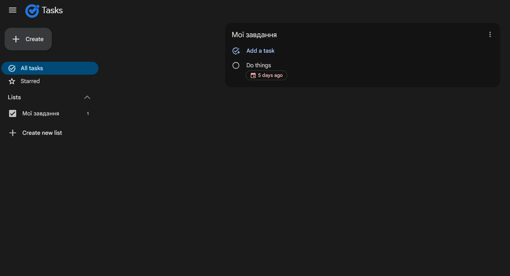
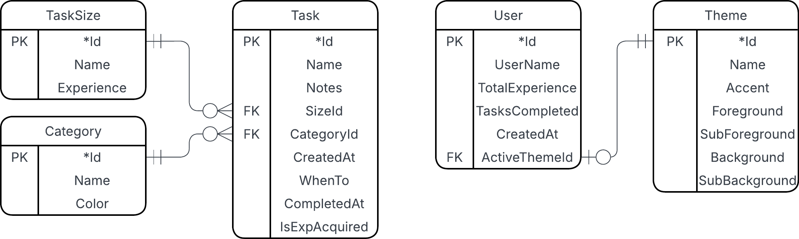
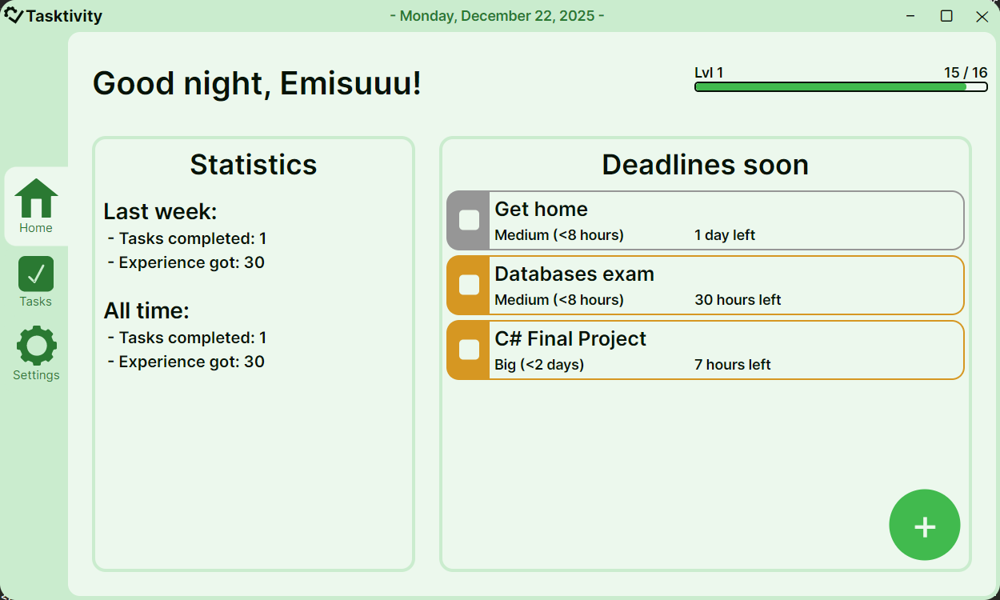
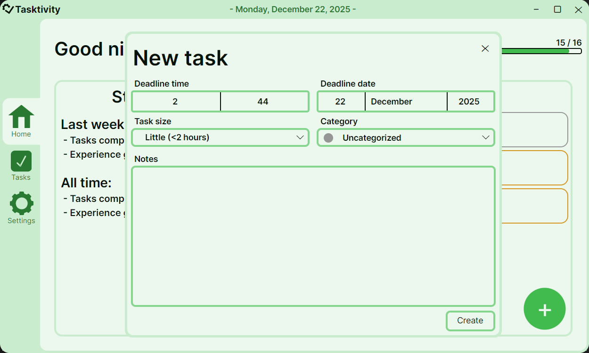
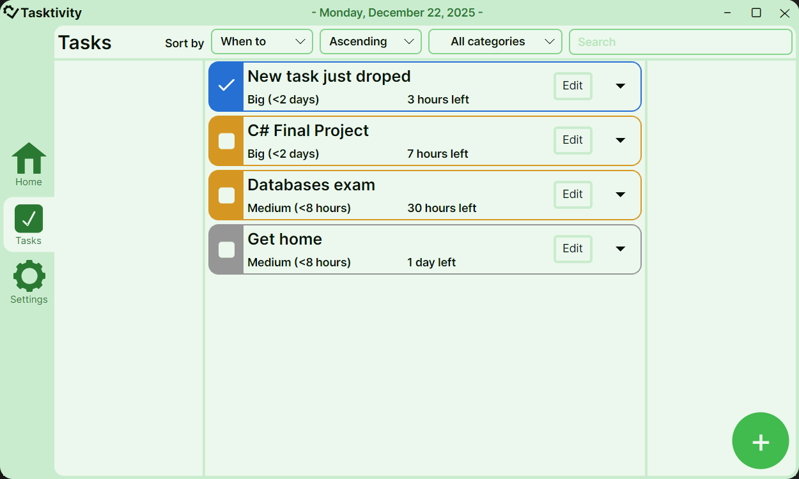

# Фінальний проєкт  
**Тема:** Програма для управління дедлайнами  
**Студент:** Луцюк Богдан Олександрович КН-213  
**Дата:** 08.12.2025  
**Посилання на репозиторій:** https://github.com/emissuu/UniTasks/tree/main/C%23/Final%20Project

## Зміст
1. [Постановка задачі](#1-постановка-задачі)
2. [Інформація про розробку](#2-інформація-про-розробку)
3. [Аналіз найближчих конкурентів](#3-аналіз-найближчих-конкурентів)
4. [Функціональні вимоги до програмного забезпечення](#4-функціональні-вимоги-до-програмного-забезпечення)
5. [Технології розробки та архітектура рішення](#5-технології-розробки-та-архітектура-рішення)
6. [Опис програмного продукту](#6-опис-програмного-продукту)
7. [Висновки](#7-висновки)

## 1. Постановка задачі
В мене була проблема з організацією всіх справ, які я маю зробити. Про щось забув, щось упустив, на якесь завдання виділив замало часу. Для вирішення цієї проблеми я розробив програму, що дає можливість легко додавати, редагувати та відслідковувати завдання. Також вирішив додати систему рівні, для підвищення мотивації виконувати завдання.

## 2. Інформація про розробку
Свій застосунок я назвав **Tasktivity**. Ця назва поєднує в собі англійські слова Task і productivity та є доволі легкою в вимові.  

**Tasktivity має мати такі функції:**
- відслідковування найближчих дедлайнів,
- перегляд статистики,
- підвищення рівню за виконання завдань,
- додавання, редагування, видалення завдань,
- зміна теми застосунку

## 3. Аналіз найближчих конкурентів
Перед створенням програми я почав розробляти перші заготовки інтерфейсу. Під час цього переглядав інші програми з такими самими функціями.  

### Google Tasks
Ця програма доступна з браузеру та має свій додаток. Вона також дає можливість додавати, редагувати і переглядати завдання. Проте вона має лише дві доступні теми. Також не має системи рівнів та статистики.  

## 4. Функціональні вимоги до програмного забезпечення
- створювати та редагувати завдання
- шукати, фільтрувати та сортувати завдання
- перегляд короткої статистики
- імплементація системи рівнів
- зміна та редагування тем 

## 5. Технології розробки та архітектура рішення
### **Мова програмування**  
Для розробки використовувалась мова програмування C#.
### **Пакети**  
В розробці використоувались такі пакети:  
1. Microsoft.EntityFrameworkCore
2. Avalonia
### **База даних**  
Для бази даних була обрана SQLite, так як вона є легкою та не потребує окремого серверу.
### **Архітектура**
Застосунок має 4 шари:  
- Data
  - Context
  - Extensions
  - Migrations
  - Models
- Repositories
  - Implementations
  - Interfaces
- Services
  - Implementations
  - Models
- UI
  - Assets
  - Views
  - Windows

### **Структура бази даних**
  

## 6. Опис програмного продукту 
При вході програма зустрічає користувача на домашній сторінці  

Звідси відразу можна перейти до створення нового завдання

Можна перейти на іншу сторінку і переглянути всі завдання. Також можна скористатись фільтрацією, сортуванням і пошуком.

В останньому вікні можна змінити деякі налаштування. Наприклад змінити тему додатку.

## 7. Висновки
Під час виконання фінального проєкту я розробив додаток для керування дедлайнами, та реалізував всі базові функції. В наслідок цього покращив свої навички написання коду на C# та AXAML. Навчився планувати та реалізувати UI з динамічними темами. Отримав краще розуміння спільноти програмістів, які мають короткі дедлайни.