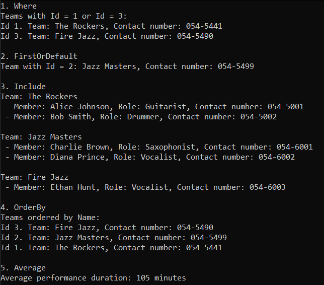

# Лабораторна робота №2  
**Тема:** Моделювання предметної області та створення реляційної бази даних у C# за допомогою EF Core (Code First)  
**Студент:** Луцюк Богдан Олександрович КН-213  
**Варіант:** 32 - Координатор подій, що організовує фестивалі  
**Дата:** 14.11.2025  
**Посилання на репозиторій:** https://github.com/emissuu/UniTasks/tree/main/C%23/Lab2

<!-- The dialog: https://kleban.notion.site/2-2a6c0ae924ac8074b50aced556a4c72f?p=2a6c0ae924ac8157ab24c1cc5d9226d1&pm=s -->

## 2. Мета роботи 
**Навчитися:**
- аналізувати предметну область і будувати концептуальну модель;
- створювати об’єктно-реляційну модель за допомогою **Entity Framework Core (Code First)**;
- поетапно розвивати структуру бази даних через **окремі міграції для кожної сутності**;
- ініціалізувати дані та виконувати базові запити LINQ.

## 3. Хід виконання
### 3.1. Аналіз предметної області (опис, таблиці, діаграма).
Після аналізу діалогу студента з замовником було винесено 12 сутностей:  
- Event: *id, administrator_id, title, date, description.
- EventBlock: *id, team_id, zone_activation_id, name, type, starts_at, ends_at.
- Team: *id, name, contact_number, transport, arrives_at, hand_color, notes.
- TeamMember: *id, team_id, ticket_id, role.  
- Ticket: *id, event_id, qr_code, buyer_name, buyer_contact_number.  
- Administrator: *id, name, contact_number.  
- Partner: *id, name, contact_number, description.
- Zone: *id, name, type, location.
- ZoneActivation: *id, partner_id, zone_id, event_id, notes.
- Worker: *id, name, contact_number, role, salary.
- WorkerShift: *id, worker_id, zone_activation_id, starts_at, ends_at.
- Incident: *id, ticket_id, type, description, happened_at, is_resolved.  

З цих сутностей було побудовано схему:  

  

### 3.2. Створення класів сутностей та контексту бази даних.
Було створено клас C# для кожної сутності бази даних. Ось зразок одного з таких класів:

```cs
public class Event
{
    [Key]
    [DatabaseGenerated(DatabaseGeneratedOption.Identity)]
    public int Id { get; set; }
    [Required]
    public string Name { get; set; }
    public DateTime? Date { get; set; }
    public string? Description { get; set; }

    [Required]
    public int AdministratorId { get; set; }
    [ForeignKey(nameof(AdministratorId))]
    public Administrator Administrator { get; set; }

    public virtual ICollection<Ticket> Tickets { get; set; } = new List<Ticket>();
    public virtual ICollection<ZoneActivation> ZoneActivations { get; set; } = new List<ZoneActivation>();
}
```

Фінальний код AppDbContext:

```cs
public class AppDbContext : DbContext
{
    public DbSet<Administrator> Administrators => Set<Administrator>();
    public DbSet<Event> Events => Set<Event>();
    public DbSet<Team> Teams => Set<Team>();
    public DbSet<Ticket> Tickets => Set<Ticket>();
    public DbSet<TeamMember> TeamMembers => Set<TeamMember>();
    public DbSet<Partner> Partners => Set<Partner>();
    public DbSet<Zone> Zones => Set<Zone>();
    public DbSet<ZoneActivation> ZoneActivations => Set<ZoneActivation>();
    public DbSet<EventBlock> EventBlocks => Set<EventBlock>();
    public DbSet<Worker> Workers => Set<Worker>();
    public DbSet<WorkerShift> WorkerShifts => Set<WorkerShift>();
    public DbSet<Incident> Incidents => Set<Incident>();
    protected override void OnConfiguring(DbContextOptionsBuilder optionsBuilder)
    {
        optionsBuilder.UseSqlServer("Data Source=localhost\\SQLEXPRESS;Initial Catalog=EventOrganizerDB;Integrated Security=True;Encrypt=True;TrustServerCertificate=True;Command Timeout=0");
        base.OnConfiguring(optionsBuilder);
    }
    protected override void OnModelCreating(ModelBuilder modelBuilder)
    {
        DbInitializer.SeedTHEData(modelBuilder);
        base.OnModelCreating(modelBuilder);
    }
}
```

### 3.3. Послідовність створених міграцій (із коротким описом змін).
Я створював міграції відразу після написання сутностей і налаштування зв'язків між ними. Перші міграції також включали в себе виправлення помилок в минулих сутностях. Ось фінальна таблиця всіх міграцій зображена в DBeaver.  


### 3.4. Ініціалізація даних та приклади запитів LINQ.
Частина коду ініціалізації даних:
```cs
public static class DbInitializer
{
    public static void SeedTHEData(this ModelBuilder modelBuilder)
    {
        // ===== Events =====
        modelBuilder.Entity<Event>().HasData(
            new Event { Id = 1, Name = "Summer Rock Festival", Date = new DateTime(2024, 8, 15), Description = "An electrifying rock music festival featuring top bands from around the world.", AdministratorId = 1 },
            new Event { Id = 2, Name = "Winter Jazz Nights", Date = new DateTime(2024, 12, 5), Description = "A cozy jazz event to warm up your winter nights with smooth tunes.", AdministratorId = 1 }
            );

        // ===== Teams =====
        modelBuilder.Entity<Team>().HasData(
            new Team { Id = 1, Name = "The Rockers", ContactNumber = "054-5441", Transport = "Bus", ArrivesAt = new DateTime(2024, 8, 14, 10, 0, 0), HandColor = "Red", Notes = "Requires backstage access." },
            new Team { Id = 2, Name = "Jazz Masters", ContactNumber = "054-5499", Transport = "Van", ArrivesAt = new DateTime(2024, 12, 4, 15, 0, 0), HandColor = "Blue", Notes = "Needs special sound equipment." },
            new Team { Id = 3, Name = "Fire Jazz", ContactNumber = "054-5490", Transport = "Car", ArrivesAt = new DateTime(2024, 12, 4, 12, 0, 0), HandColor = "Green", Notes = "Bringing their own instruments." }
            );
    }
}
```

Приклади запитів LINQ:
```cs
using (var context = new Main.Context.AppDbContext())
{
    // ===== Where =====
    Console.WriteLine("1. Where");
    List<Team> participants = context.Teams
        .Where(a => a.Id == 1 || a.Id == 3)
        .ToList();
    Console.WriteLine($"Teams with Id = 1 or Id = 3:");
    foreach (var team in participants)
        Console.WriteLine($"Id {team.Id}. Team: {team.Name}, Contact number: {team.ContactNumber}");

    // ===== FirstOrDefault =====
    Console.WriteLine("\n2. FirstOrDefault");
    Team? team1 = context.Teams
        .FirstOrDefault(a => a.Id == 2);
    if (team1 != null) Console.WriteLine($"Team with Id = 2: {team1.Name}, Contact number: {team1.ContactNumber}");
    else Console.WriteLine("Team with Id = 2 not found");

    // ===== Include =====
    Console.Write("\n3. Include");
    List<Team> teamsWithMembers = context.Teams
        .Include(t => t.TeamMembers)
        .ThenInclude(tm => tm.Ticket)
        .ToList();
    foreach (var team in teamsWithMembers)
    {
        Console.WriteLine($"\nTeam: {team.Name}");
        foreach (var member in team.TeamMembers)
            Console.WriteLine($" - Member: {member.Ticket.BuyerName}, Role: {member.Role}, Contact number: {member.Ticket.BuyerContactNumber}");
    }

    // ===== OrderBy =====
    Console.WriteLine("\n4. OrderBy");
    List<Team> teamsOrdered = context.Teams
        .OrderBy(t => t.Name)
        .ToList();
    Console.WriteLine("Teams ordered by Name:");
    foreach (var team in teamsOrdered)
        Console.WriteLine($"Id {team.Id}. Team: {team.Name}, Contact number: {team.ContactNumber}");

    // ===== Average =====
    Console.WriteLine("\n5. Average");
    // average performance duration counting from StartsAt to EndsAt in EventBlocks
    double? averageDuration = context.EventBlocks
        .Where(e => e.Type == "Performance")
        .Average(eb => EF.Functions.DateDiffMinute(eb.StartsAt, eb.EndsAt));
    Console.WriteLine($"Average performance duration: {averageDuration} minutes");
}
```

Результати виконання LINQ запитів:  


LINQ запити є дуже потужним  та зручним інструментом для вибірки даних. Вони є невід'ємною частиною будь-якої програми, яка взаємодії з базами даних.

## 4. Результати роботи
Схема зв'язків зображена в DBeaver:  

 

## 5. Висновки 
Під час виконання цієї лабораторної роботи я покращив свої навики планування бази даних та її реалізації в коді C#. Вивичив особливості створення міграцій та заповнення бази даних за допомогою екстеншн методу. Попрактикував витягування даних з БД за допомогою класу LINQ. Також, покращив навики створення схеми бази даних і роботи з програмами LucidApp і DBeaver.