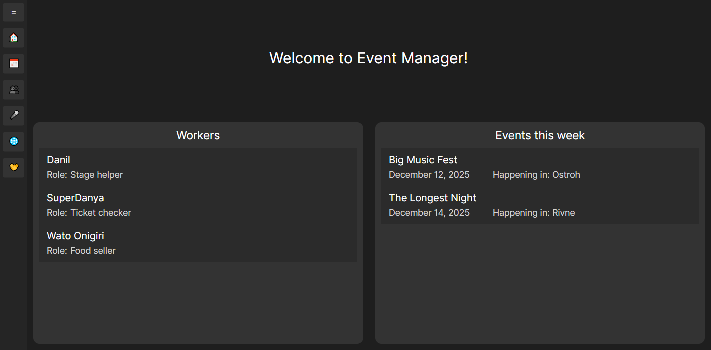
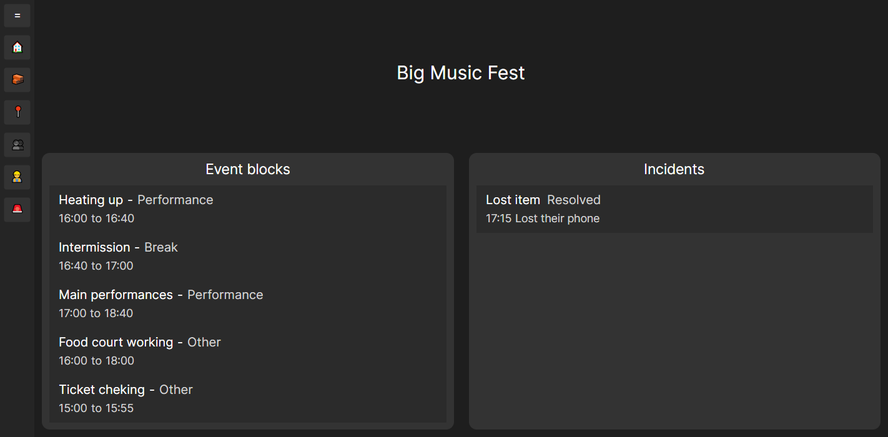
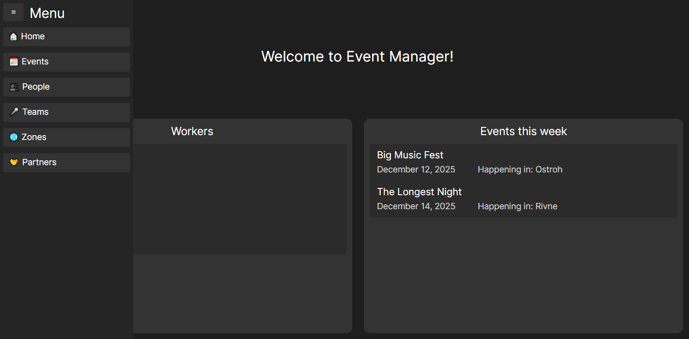

# Лабораторна робота №3  
**Тема:** Розробка повноцінного застосунку на C# з використанням EF Core та Repository Pattern  
**Студент:** Луцюк Богдан Олександрович КН-213  
**Варіант:** 32 - Координатор подій, що організовує фестивалі  
**Дата:** 26.11.2025  
**Посилання на репозиторій:** https://github.com/emissuu/UniTasks/tree/main/C%23/Lab3

## 2. Мета роботи
Розробити повноцінний багатошаровий застосунок на C# з використанням EF Core, Repository Pattern, шару Services, аналізу конкурентів, продуманого UI.

## 3. Опис предметної області
Моєю темою був застосунок для управління подіями. Головними сутностями в мене є люди, події, зони і команди.  
Головними сценаріями роботи моєї програми є реєстрація людей, зон, команд та івентів. Також управління програмою подій, продаж білетів і розподілення працівників.

## 4. Архітектура застосунку
Моя програма складається з 4 шарів: Data, Repositories, Services, UI. 
- **Data:** відповідає за беспосередній зв'язок з базою даних, зберагіє в собі всі моделі.
- **Repositories:** бере на себе початкову взаємодію з файлами, напряму співпрацює з базою даних.
- **Services:** займається обробкою даних і підготовкою їх до відправки в шар UI.
- **UI:** майже не займається обробкою даних, а лише візуалізує їх. Зв'язує користувача з шаром Services. 

## 5. Реалізація функціональності 
### Основні сценарії роботи
Основними сценаріями роботи програми є
- додавання людей, зон, партнерів, команд
- створення події та зміни інформації про неї
- організація окремих блоків події в кожній з зон
- додавання білетів за користувачами до подій
- призначення робітників на блоки події
- додавання інцидентів та відстеження їх

### Код репозиторіїв і сервісів
Мною було прийнято рішення реалізувати один generic репозиторій і успадковувати всі репозиторії моделей від нього. За допомоогою цього підходу я можу легко змінити його, або внести зміни в один з окремих репозиторіїв не впливаючи на інші.  

Код generic репозиторію.  
```cs
public class Repository<T> : IRepository<T> where T : class
{
    protected readonly DbContext _context;
    protected readonly DbSet<T> _dbSet;
    public Repository(DbContext context)
    {
        _context = context;
        _dbSet = _context.Set<T>();
    }
    public IEnumerable<T> GetAll() => _dbSet.AsNoTracking().ToList();
    public T? GetById(int id) => _dbSet.Find(id);
    public void Add(T entity) => _dbSet.Add(entity);
    public virtual void Update(T entity)
    {
        _dbSet.Attach(entity);
        _context.Entry(entity).State = EntityState.Modified;
    }
    public void Delete(int id) 
    {
        var entity = GetById(id);
        if (entity != null) _dbSet.Remove(entity);
    } 
    public void Save()
    {
        if (_context.ChangeTracker.HasChanges())
            _context.SaveChanges();
    }
}
```

Код окремого репозиторію.
```cs
public class IncidentRepository : Repository<Incident>
{
    public IncidentRepository(DbContext context) : base(context) { }
    public override void Update(Incident entity)
    {
        var existingPerson = _dbSet.Find(entity.Id);
        if (existingPerson != null)
        {
            _context.Entry(existingPerson).CurrentValues.SetValues(entity);
        }
    }
    public IEnumerable<Incident> GetAllTickets()
    {
        return _context.Set<Incident>().Include(i => i.Ticket).AsNoTracking().ToList();
    }
}
```

З сервісами все ж трішки по іншому. Розмір кожного з них відрізняється в залежності від потреб моделі.  

Код окремого сервісу.
```cs
public class ZoneService
{
    private readonly ZoneRepository _repo;
    public ZoneService(ZoneRepository repo) => _repo = repo;
    public IEnumerable<Data.Models.Zone> GetAll()
    {
        return _repo.GetAll().ToList();
    }
    public IEnumerable<string> GetAllNames()
    {
        return _repo.GetAll().Select(z => z.Name).ToList();
    }
    public int GetIdByName(string name)
    {
        var admin = _repo.GetAll().FirstOrDefault(z => z.Name == name);
        return admin != null ? admin.Id : -1;
    }
    public void Add(Data.Models.Zone zoneModel)
    {
        _repo.Add(zoneModel);
        _repo.Save();
    }
    public void Update(Data.Models.Zone zoneModel)
    {
        _repo.Update(zoneModel);
        _repo.Save();
    }
    public void Delete(int id)
    {
        _repo.Delete(id);
        _repo.Save();
    }
}
```

### Linq запити
Linq запити дуже широко використовуються як в сервісах так і в репозиторіях.  

Для прикладу метод з класу EventBlockService  
```cs
public IEnumerable<string> GetAllEventBlockNamesByEventId(int eventId)
{
    return _repo.GetAllZoneActivation()
                .Where(eb => eb.ZoneActivation.EventId == eventId)
                .Select(eb => eb.Name)
                .ToList();
}
```

## 6. Аналіз конкурента та UI
Я не зміг обрати один сайт для аналізу, так як вони не сходились з моєю ідеєю застосунку. Проте я взяв деякі ідеї з сайтів конкурентів.  
### [Concert.ua](https://concert.ua)
Мені сподобалось те, як на головній відображаються події, що відбудуться незабаром. Тому я вирішив реалізувати в себе таку ж саму функцію.


Також схоже було реалізовано на головній сторінці перегляду події.


## 7. Результати роботи 
Мій щастосунок складається лише з двох вікон, але кожне з них має по 6 окремих переглядів. При відкритті програми, користувача завжди зустріне головна сторінка цього вікна.  

Головна сторінка застосунку. І панель навігації зліва.


Всі перегляди хоч і схожі між собою, але мають різні поля і особливості, які допомагають редагувати свій об'єкт.


Вікно редагування подій дає більше інструментів для управління подіями.


В вікні редагування подій є перегляди схожі до переглядів в минулому вікні, проте ці можуть редагувати лише об'єкти пов'язані з обраною подією.


## 8. Висновки
Під час виконання цієї лабораторної роботи я навчився:
- працювати з зовнішнім розширенням Avalonia для написання графічного інтерфейсу користувача;
- писати repository і service класи та розвивати їх під потреби GUI;
- краще планувати архітектуру програми;
- будувати інтерактивний UI.

Під час виконання роботи виникли такі труднощі:
- нехватка часу, через велику кількість нових концептів, які потрібно використати;
- важкість планування застосунку такого відносно великого розміру.

Але попри всі ці труднощі, в мене все одно вийшло реалізувати повноцінний застосунок для управління подіями з застосуванням EF core для управління базою даних.